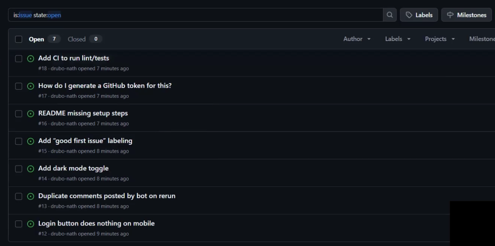
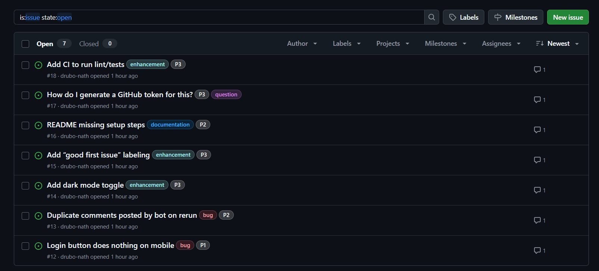

# GitHub Issue Triage Agent

> An AI-powered bot that reads your GitHub issues, figures out what they're about, and takes action — labels them, sets priority, posts helpful responses. Zero manual work.

**[Live Demo](https://github.com/drubo-nath/issue-triage-demo/issues)** · **[Dashboard]()** · **[Video Walkthrough]()**


---

## The Problem

If you maintain an open source project, you know the drill:

- New issue comes in
- You read it, try to understand what they're asking
- Decide if it's a bug, feature request, or just a question
- Apply the right labels
- Write a response acknowledging it
- Repeat 50 times a week

It's tedious. It takes time away from actually building things.

## The Solution

This bot does all of that automatically.

You point it at a repo, hit run, and it:

1. **Fetches** all open issues
2. **Reads** each one and understands the context
3. **Categorizes** it (bug, enhancement, question, documentation)
4. **Prioritizes** it (P1-Critical through P4-Low)
5. **Labels** the issue on GitHub
6. **Comments** with a helpful first response

The whole thing takes about 30 seconds for 10 issues.

---

## Demo

### Before


### After


Check the actual repo: **[drubo-nath/issue-triage-demo](https://github.com/drubo-nath/issue-triage-demo/issues)**

---

## Getting Started

### Prerequisites

- Docker installed
- GitHub Personal Access Token ([create one here](https://github.com/settings/tokens)) with `repo` scope
- OpenRouter API Key ([free signup](https://openrouter.ai))

### Run Kestra

```bash
docker run --pull=always --rm -it -p 8080:8080 --user=root \
  -v /var/run/docker.sock:/var/run/docker.sock \
  -v /tmp:/tmp \
  kestra/kestra:latest server local
```

### Add the Flow

1. Open http://localhost:8080
2. Go to **Flows** → **Create**
3. Copy the contents of `flows/github-issue-triage-v3.yml` and paste it
4. Click **Save**

### Execute

1. Click **Execute**
2. Enter your GitHub token and OpenRouter API key
3. Set the repo owner/name (or use the defaults)
4. First run: keep `dry_run` as `true` to preview
5. When ready: set `dry_run` to `false` and watch it work

---

## Project Structure

```
├── flows/
│   └── github-issue-triage-v3.yml   # The main Kestra flow
├── dashboard/                        # Next.js analytics dashboard
│   ├── app/
│   │   ├── page.js
│   │   ├── layout.js
│   │   └── globals.css
│   └── package.json
├── docs/                             # Screenshots for README
└── README.md
```

---

## How It Works

```
┌──────────────┐      ┌──────────────┐      ┌──────────────┐
│   GitHub     │      │    Kestra    │      │   GitHub     │
│   Issues     │─────▶│   AI Agent   │─────▶│   Labels +   │
│   (input)    │      │   (brain)    │      │   Comments   │
└──────────────┘      └──────────────┘      └──────────────┘
```

**Flow breakdown:**

| Step | Task | What it does |
|------|------|--------------|
| 1 | `fetch_issues` | Calls GitHub API to get open issues |
| 2 | `triage_agent` | Sends issues to AI, gets back structured JSON |
| 3 | `apply_actions` | Python script that POSTs labels and comments |
| 4 | `report` | Outputs a summary |

The AI is prompted to return pure JSON, so we can parse it reliably and take action.

---

## Tech Stack

| Layer | Tech |
|-------|------|
| Orchestration | [Kestra](https://kestra.io) |
| AI | [OpenRouter](https://openrouter.ai) (free tier) |
| Data Source | GitHub REST API |
| Dashboard | Next.js 14 + Tailwind CSS |

---


**Requirements met:**

| Criteria | How we meet it |
|----------|----------------|
| Use Kestra's AI Agent | ✅ `io.kestra.plugin.ai.agent.AIAgent` |
| Summarize data from external system | ✅ Fetches and analyzes GitHub issues |
| Make decisions (bonus) | ✅ Auto-labels and auto-comments based on analysis |

---

## Future Ideas

- **Webhook trigger** — Run automatically when new issues are created
- **Slack alerts** — Ping the team for P1 bugs
- **Multi-repo** — Triage across an entire organization
- **Custom rules** — Let users define their own label mappings
- **Learning** — Improve over time based on human corrections

---

## Run the Dashboard

```bash
cd dashboard
npm install
npm run dev
```

Open http://localhost:3000 to see triage history and stats.

---

## License

MIT — do whatever you want with it.

---

## Author

**Drubo Nath**

- GitHub: [@drubo-nath](https://github.com/drubo-nath)
- Built in a weekend for WeMakeDevs Hackathon 2025
